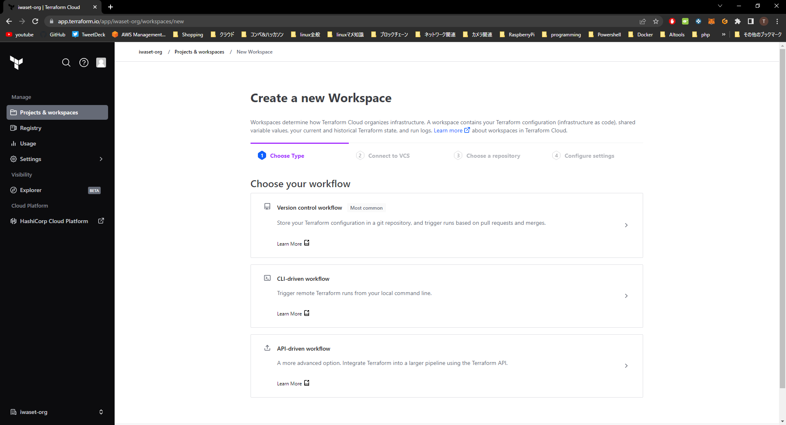
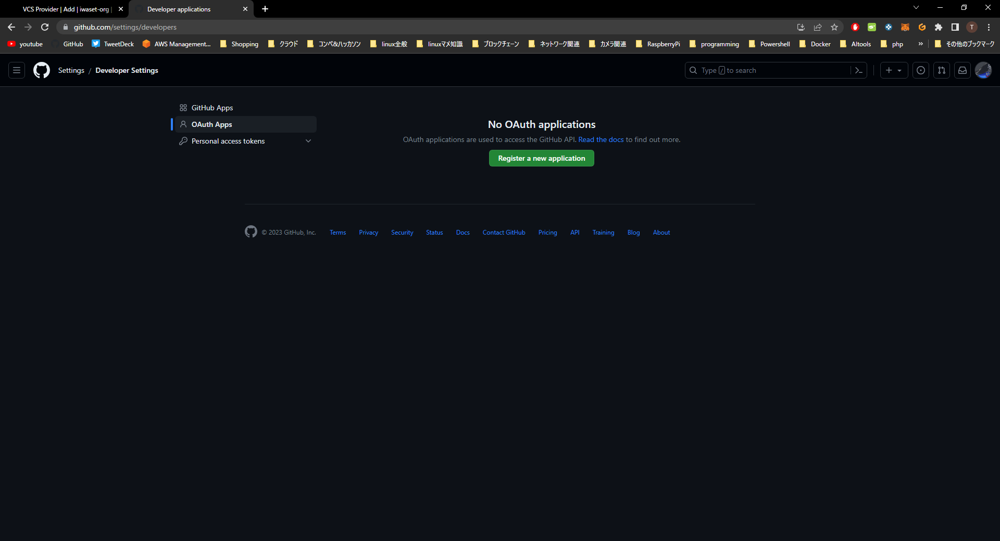
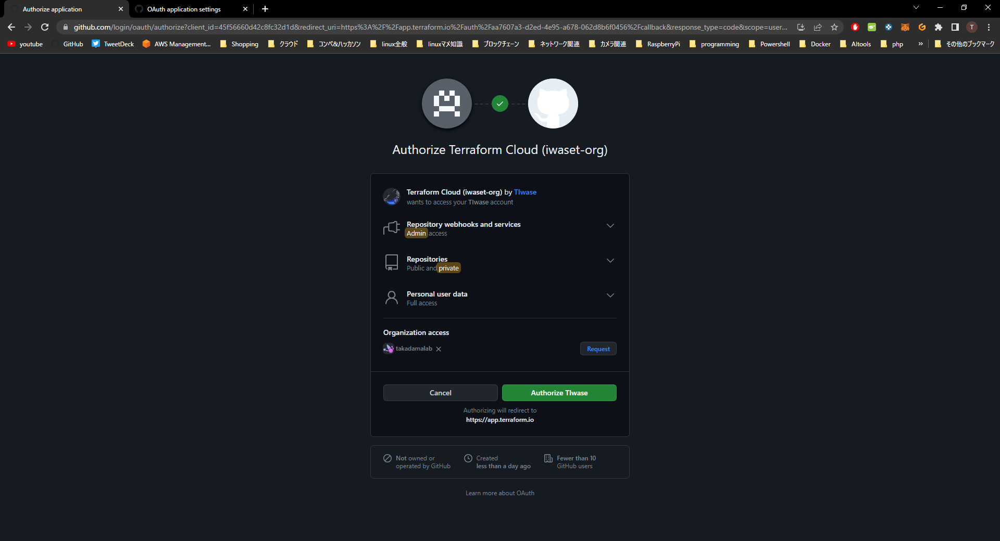
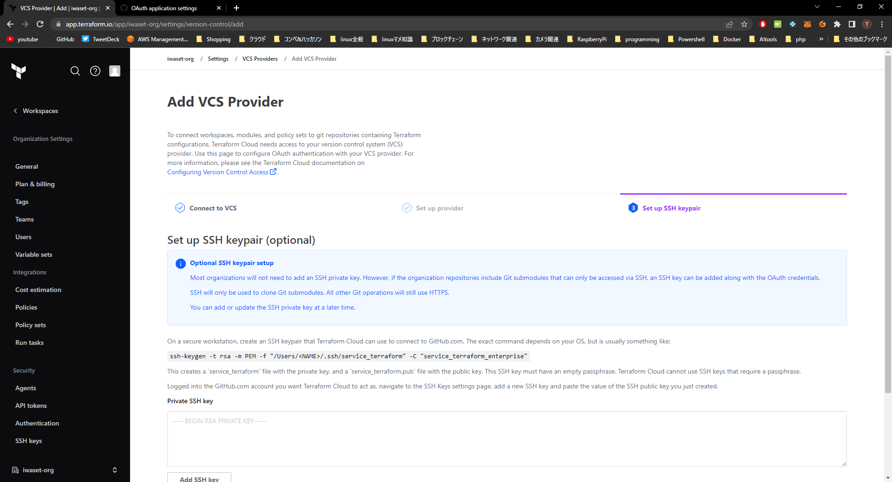
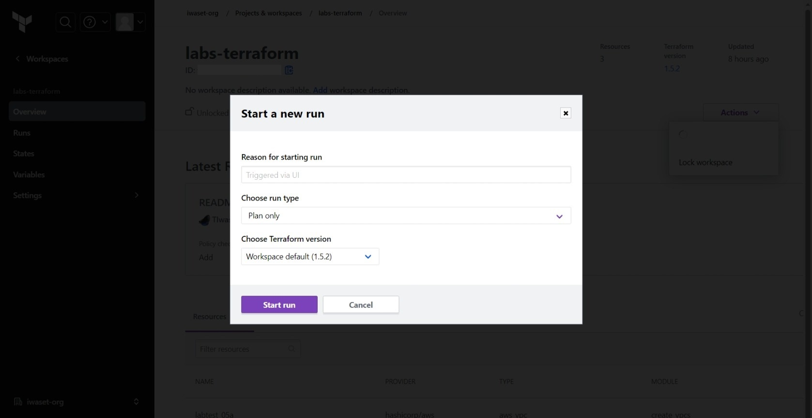
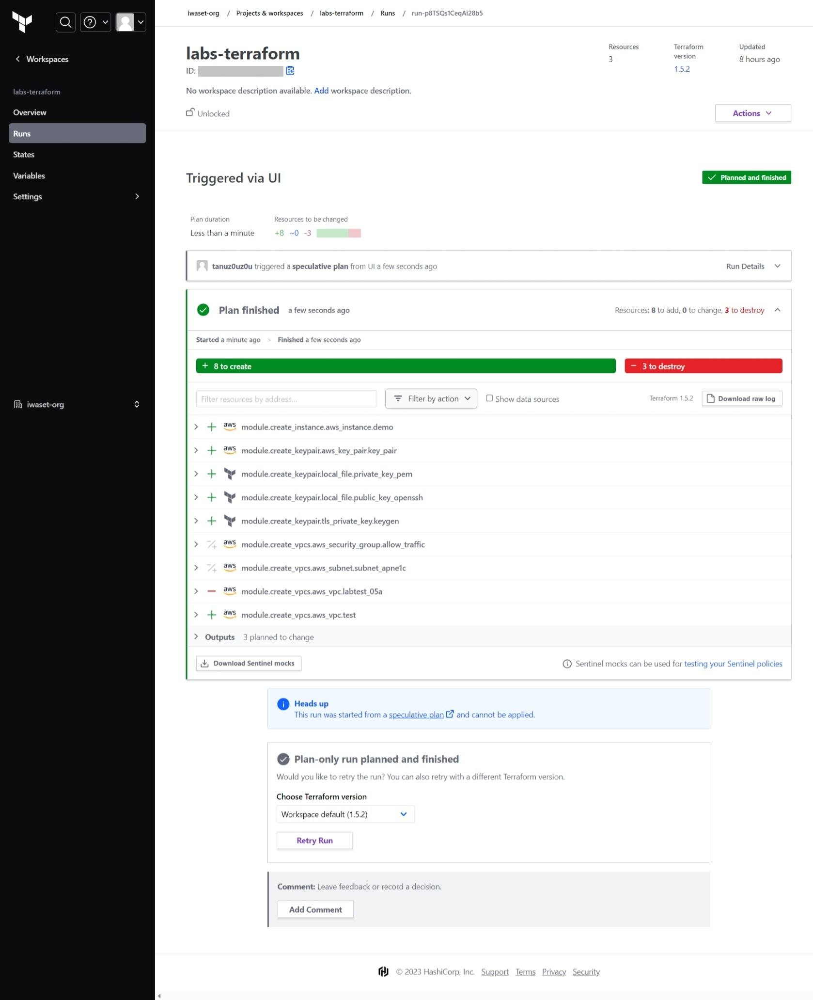
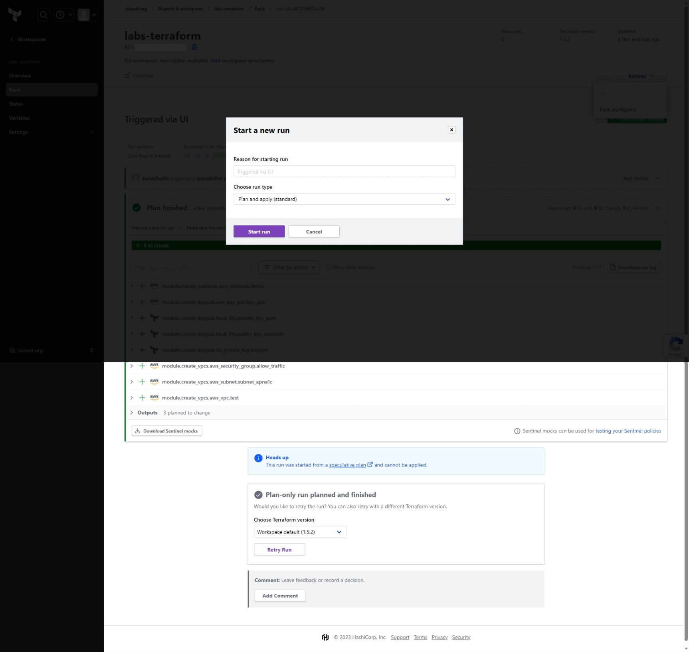

# Terraform CloudのVCS-driven WorkflowによるEC2デプロイ

[EC2デプロイ手順](#ec2デプロイ手順)  
- [terraform構成](#terraform構成)  
- [1. 事前準備](#1-事前準備)  
  - [1.1. Workspace新規作成](#11-workspace新規作成)
  - [1.2. Workspace設定](#12-workspace設定)
  - [1.3. Variables設定](#13-variables設定)
- [2. リソースデプロイ](#2-リソースデプロイ)
  - [2.1. デバッグ](#21-デバッグ)
  - [2.2. 適用](#22-適用)
- [3. リソース削除](#3-リソース削除)
  - [3.1. destroy実行](#31-destroy実行)
  
## terraform構成

|Directory|Module|Description|
|--|--|--|
|[aws-createVpcs](./modules/aws-createVpcs/)|module.create_vpcs|VPC/Subnet/SG作成|
|[aws-createKeyPair](./modules/aws-createKeyPair/)|module.create_keypair|キーペア作成|
|[aws-createEc2](./modules/aws-createEc2/)|module.create_instance|EC2作成|

## 1. 事前準備
### 1.1. Workspace新規作成
 
※既存Workspaceを利用する場合は本手順をスキップして「1.2. Workspace設定」へ進む  

- Terraform Cloud側の設定  
[Projects & workspaces] > [New] > [Workspace]を選択する。  
[1. Choose Type]ページにて、[Version control workflow]を選択する

[2. Connect to VCS]ページにて、[Github.com\(Custom\)]を選択する

[Set up provider]ページにて、表示された下記情報を控える

> - Application name
> - Homepage URL
> - Authorization callback URL  

- VCS側(Github)の設定  
VCS(ここではGithub)にサインインし、[Settings] > [Developer settings] > [OAuth Apps]の[Register a new application]を選択する

上記で控えた情報をペーストし、[Register application]を選択

発行されたClient IDと、Client secretを控える

- Terraform Cloud側の設定(再び)  
Terraform Cloudの[Set up provider]ブラウザページにて、Nameに任意の値を入力し、上記で控えたClient IDとClient secretを入力して[Connect and continue]を選択

認証を許可する(Authorizeをクリック)

[3. Set up SSH keypair]ページにて、optionalであるため、ここの設定はスキップする

### 1.2. Workspace設定
対象のWorkspaceを選択し、[Settings] > [General] > [Exection Mode]をRemoteにし、[Terraform Working Directory]に対象のディレクトリを入力し、[Save settings]を選択  
※ここでは、[lab-practive-05b]をWorking Directoryに設定  

### 1.3. Variables設定
対象のWorkspaceを選択し、[Variables] > [Workspace variables]から[\+ Add variable]を選択し、AWSアカウントのIAMクレデンシャル情報を下記の通りに入力して[Add variable]を押下  
※Sensitiveのチェックボックスを選択し、Descriptionは必要に応じて記入する

|Key|Value|variable category|
|--|--|--|
|AWS_ACCESS_KEY_ID|AKIAXXXXXXXXX|Environment variable|
|AWS_SECRET_ACCESS_KEY|XXXXXXXXXXXX|Environment variable|

## 2. リソースデプロイ
### 2.1. デバッグ 
対象Workspaceを選択し、[Actions] > [Start new run]を選択する

[run type]を[Plan only]にし、[Terraform version]は[Default (1.5.2)]として[Start run]を押下　　

Plan finishedと出力されていれば、デバッグ完了

### 2.2. 適用
対象Workspaceを選択し、[Actions] > [Start new run]を選択する  
[run type]を[Plan and apply]にし[Start run]を押下　　

Plan finishedと出力されたら、[Cinfirm & Apply]を押下

Apply finishedと出力されることを確認する

## 3. リソース削除
### 3.1. destroy実行
対象Workspaceを選択し、[Settings] > [Destruction and Deletion] > [Manually destroy] > [Queue destroy plan]を選択

Workspace名を入力して、[Queue destroy plan]を押下

Plan finishedと出力されたら[Confirm & Apply]を押下

[Confirm Plan]を押下

Apply finishedと出力されていればリソース削除完了
