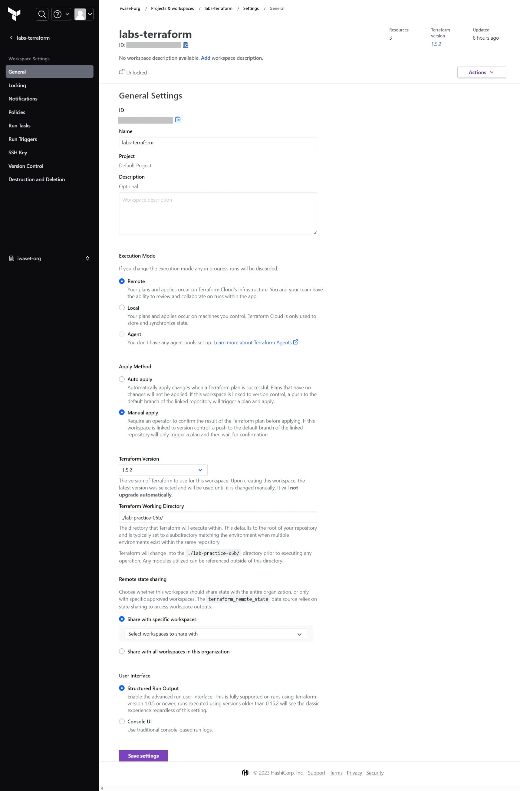
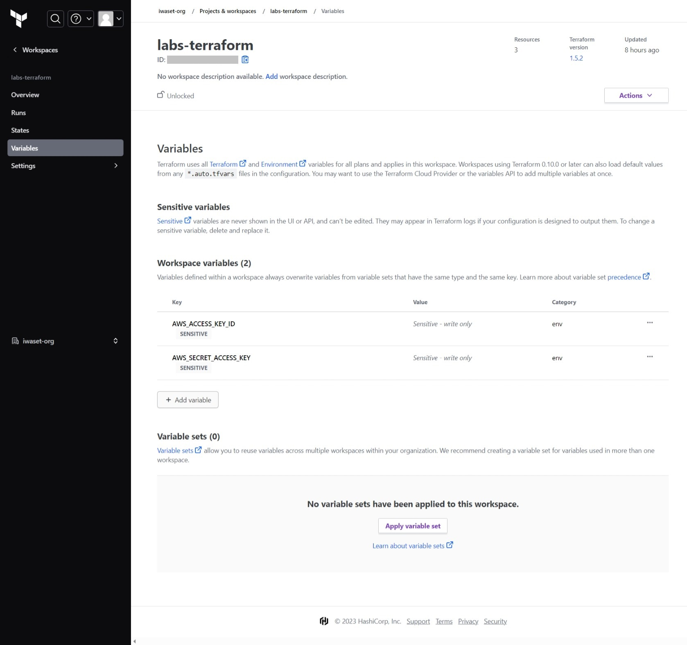

# Terraform CloudのVCS-driven WorkflowによるEC2デプロイ(Policy Set設定)

[EC2デプロイ手順](#ec2デプロイ手順)  
- [terraform構成](#terraform構成)  
- [1. 事前準備](#1-事前準備)  
  - [1.1. Workspace新規作成](#11-workspace新規作成)
  - [1.2. Workspace設定](#12-workspace設定)
  - [1.3. Variables設定](#13-variables設定)
- [2. Policy定義ファイル準備](#2-policy定義ファイル準備)
  - [2.1. Sentinel Mock Data取得](#21-sentinel-mock-data取得)
  - [2.2. Policy定義ファイルの作成](#22-policy定義ファイルの作成)
  - [2.3. Mock Data修正](#23-mock-data修正)
  - [2.4. Policyの検証](#24-policyの検証)
- [3. Policy Set作成](#3-policy-set作成)
  - [3.1. Policy Set作成](#31-policy-set作成)
  - [3.2. Policy作成](#32-policy作成)
- [4. Terraform CloudからEC2デプロイ](#4-terraform-cloudからec2デプロイ)
  - [4.1. 適用](#41-適用)
  
## terraform構成

|Directory|Module|Description|
|--|--|--|
|[aws-createVpcs](./modules/aws-createVpcs/)|module.create_vpcs|VPC/Subnet/SG作成|
|[aws-createKeyPair](./modules/aws-createKeyPair/)|module.create_keypair|キーペア作成|
|[aws-createEc2](./modules/aws-createEc2/)|module.create_instance|EC2作成|


## 1. 事前準備
### 1.1. Workspace新規作成
 
※既存Workspaceを利用する場合は本手順をスキップして「1.2. Workspace設定」へ進む  

- Terraform Cloud側の設定  
[Projects & workspaces] > [New] > [Workspace]を選択する。  
[1. Choose Type]ページにて、[Version control workflow]を選択する

[2. Connect to VCS]ページにて、[Github.com\(Custom\)]を選択する

[Set up provider]ページにて、表示された下記情報を控える

> - Application name
> - Homepage URL
> - Authorization callback URL  


- VCS側(Github)の設定  
VCS(ここではGithub)にサインインし、[Settings] > [Developer settings] > [OAuth Apps]の[Register a new application]を選択する

上記で控えた情報をペーストし、[Register application]を選択

発行されたClient IDと、Client secretを控える


- Terraform Cloud側の設定(再び)  
Terraform Cloudの[Set up provider]ブラウザページにて、Nameに任意の値を入力し、上記で控えたClient IDとClient secretを入力して[Connect and continue]を選択

認証を許可する(Authorizeをクリック)

[3. Set up SSH keypair]ページにて、optionalであるため、ここの設定はスキップする


### 1.2. Workspace設定
対象のWorkspaceを選択し、[Settings] > [General] > [Exection Mode]をRemoteにし、[Terraform Working Directory]に対象のディレクトリを入力し、[Save settings]を選択  
※ここでは、[lab-practive-06]をWorking Directoryに設定  


### 1.3. Variables設定
対象のWorkspaceを選択し、[Variables] > [Workspace variables]から[\+ Add variable]を選択し、AWSアカウントのIAMクレデンシャル情報を下記の通りに入力して[Add variable]を押下  
※Sensitiveのチェックボックスを選択し、Descriptionは必要に応じて記入する

|Key|Value|variable category|
|--|--|--|
|AWS_ACCESS_KEY_ID|AKIAXXXXXXXXX|Environment variable|
|AWS_SECRET_ACCESS_KEY|XXXXXXXXXXXX|Environment variable|





## 2. Policy定義ファイル準備
### 2.1. Sentinel Mock Data取得
対象Workspaceを選択し、[Actions] > [Start new run]を選択する


[run type]を[Plan only]にし、[Terraform version]は[Default (1.5.2)]として[Start run]を押下　　

Plan finishedと出力されていれば、デバッグ完了  
[Download Sentinel mocks]を選択し、ローカル環境にMock Dataをダウンロードする (gitpodのworkspace上にMock Dataをアップロードする)  
ダウンロードしたtgzファイル解凍後、下記ファイル以外は使用しないため、別ディレクトリ等に退避しておく
- sentinel.hcl
- mock-tfplan-v2.sentinel

### 2.2. Policy定義ファイルの作成
上記でダウンロードしたディレクトリと同じ階層に、下記内容の[restrict-aws-instance-tag.sentinel](./policies/restrict-aws-instance-tag.sentinel)を作成する
```
import "tfplan/v2" as tfplan

# Get AWS instance from modules
ec2_instance = filter tfplan.resource_changes as _, rc {
  rc.type is "aws_instance" and
    (rc.change.actions contains "create" or rc.change.actions is ["update"])
}

# Mandatory Instance Tags
mandatory_tags = [ "Managed" ]

# Rule to enforce "Managed" tags on all instances
mandatory_instance_tags = rule {
  all ec2_instance as _, instance {
    all mandatory_tags as mt {
      instance.change.after.tags contains mt
    }
  }
}

# Main rule that requires other rules to be true
main = rule {
  (mandatory_instance_tags) else true
}

# https://github.com/hashicorp/learn-sentinel-write-policy
```
※mock-tfplan-v2.sentinelに記載されているリソースblock名が正しいことを確認しておく  
※例\) resource_changesブロックの中に、aws_instanceが存在していること

### 2.3. Mock Data修正
2.1節でダウンロードしたsentinel.hclファイルを[下記内容](./policies/sentinel.hcl)に修正する
```
policy "restrict-aws-instance-tag" {
  source = "./restrict-aws-instance-tag.sentinel"
  enforcement_level = "hard-mandatory"
}
mock "tfplan/v2" {
  module {
    source = "mock-tfplan-v2.sentinel"
  }
}
```

### 2.4. Policyの検証
下記ファイルが配置されているディレクトリにて、次のコマンドを実行する
- sentinel.hcl
- mock-tfplan-v2.sentinel
- restrict-aws-instance-tag.sentinel

```bash
sentinel apply restrict-aws-instance-tag.sentinel
```
下記が出力されることを確認する
```
Pass - restrict-aws-instance-tag.sentinel
```
## 3. Policy Set作成
### 3.1. Policy Set作成
TerraformCloudにサインインし、[Organization Settings] > [Policy sets] > [Connect a new policy set]を選択


Free Planでは、VCSのリモートリポジトリ配下にあるsentinelファイルを読み込めないため、ここでは[No VCS connection]を選択する


下表の情報を入力し、[Connect policy set]を選択  


|入力項目|設定値 (記入例)|
|--|--|
|Policy framework|Sentinel|
|Name|任意の値 (labs-terraform-sentinel)|
|Scope of policies|Policies enforced on selected projects and workspaces|
|Projects|Default Project|
|Workspaces|上記手順で作成したWorkspace名 (labs-terraform)|


### 3.2. Policy作成
[Organization Settings] > [Policies] > [Create a new policy]を選択


下表の情報を入力し、[Create policy]を選択  

|入力項目|設定値 (記入例)|
|--|--|
|Policy framework|Sentinel|
|Name|任意の値 (restrict-aws-instance-tag)|
|Enforcement behavior|Hard mandatory|
|Policy code| (2.2節で作成したsentinelファイルの中身をコピペ)|
|Policy Sets|上記3.3節で作成したPolicy Set名 (labs-terraform-sentinel)|


## 4. terraform cloudからEC2デプロイ
### 4.1. 適用
対象Workspaceを選択し、[Actions] > [Start new run]を選択する  
[run type]を[Plan and apply]にし[Start run]を押下　　


インスタンスに「Managed」タグが無いというエラーが出力されることを確認する
