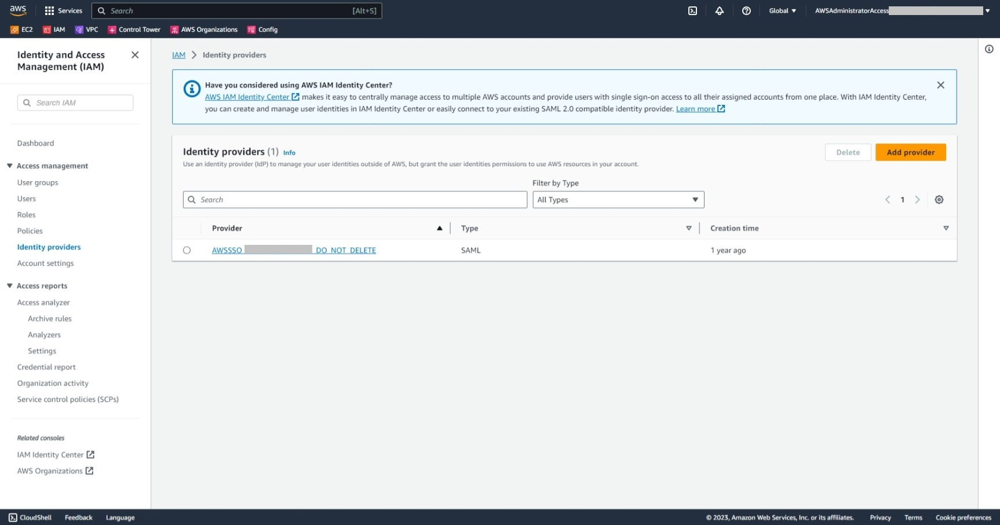
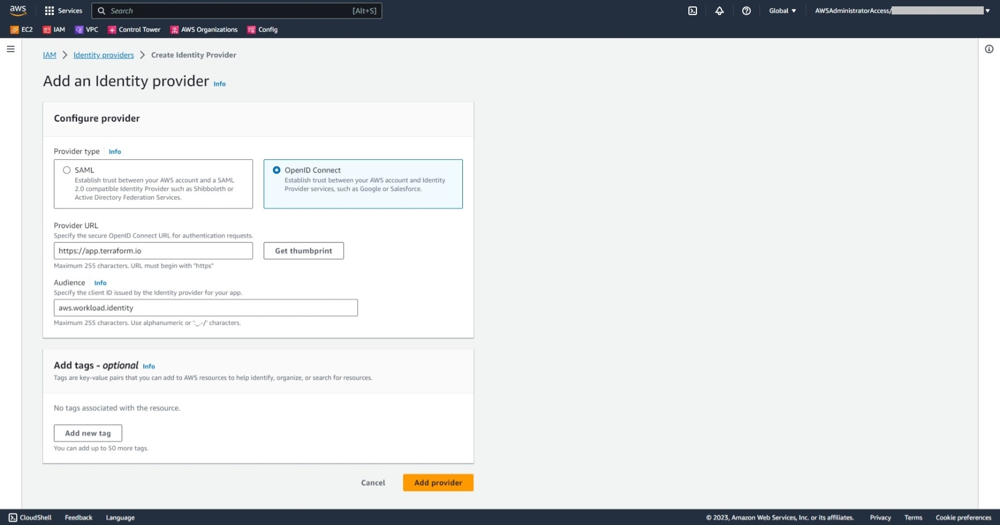
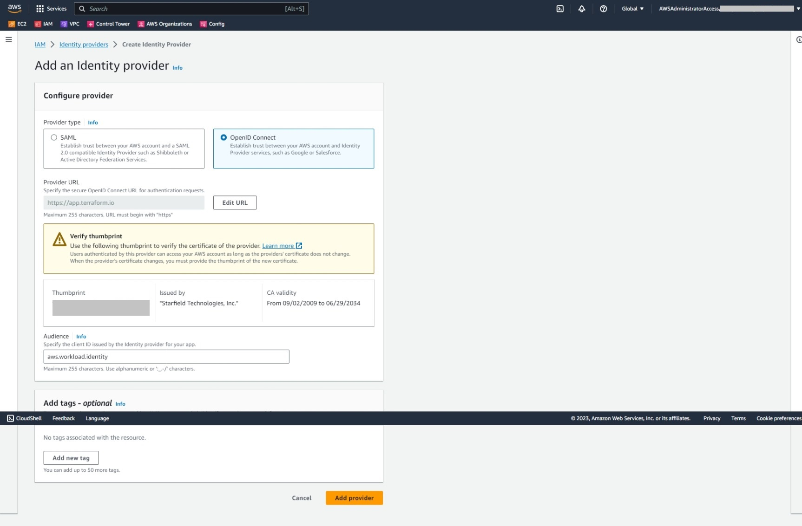
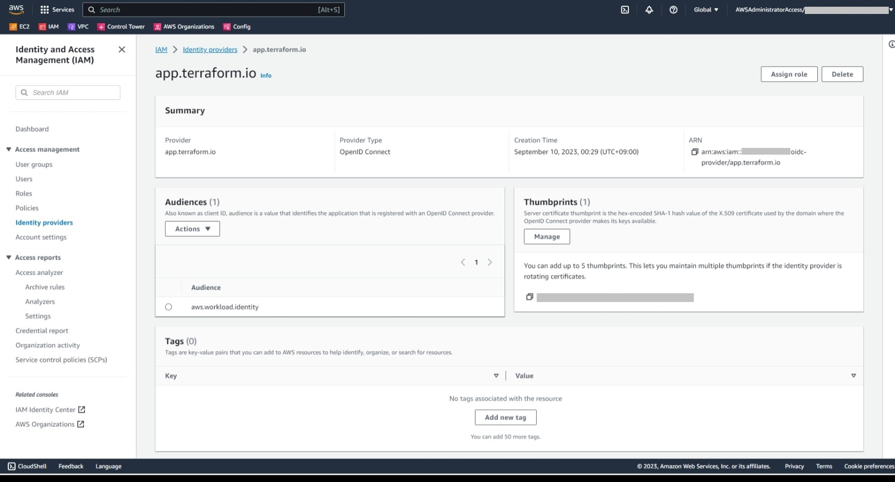
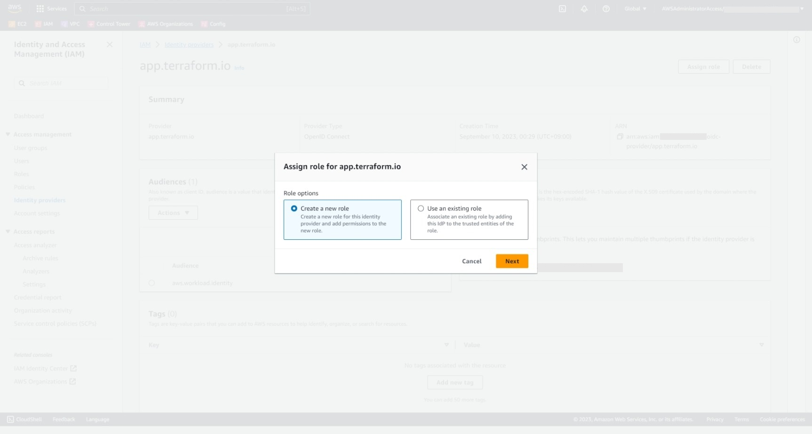
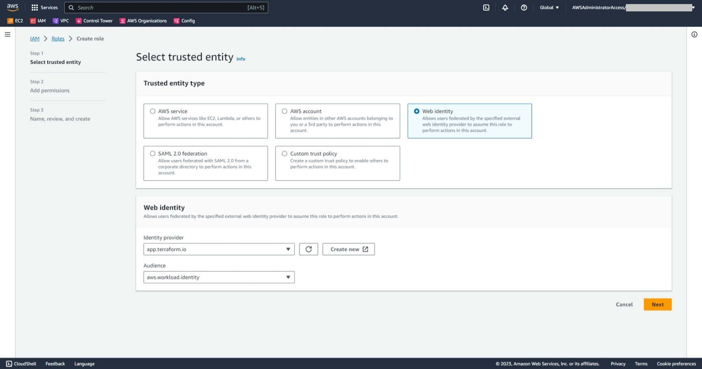
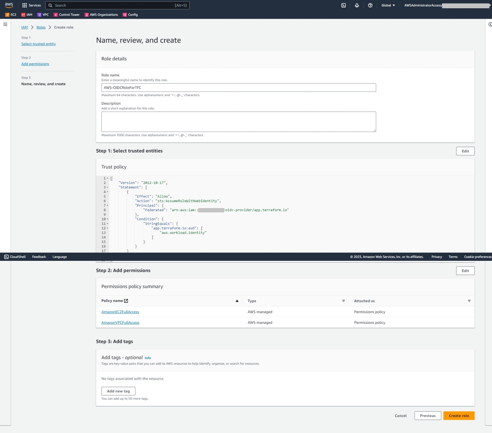
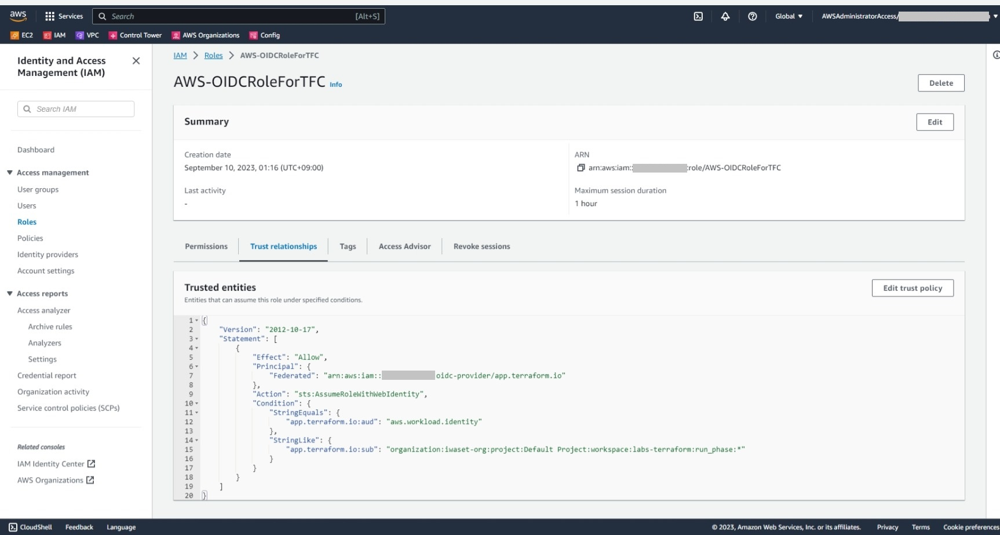
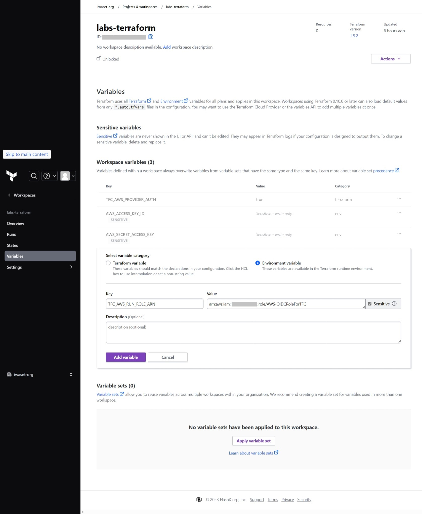
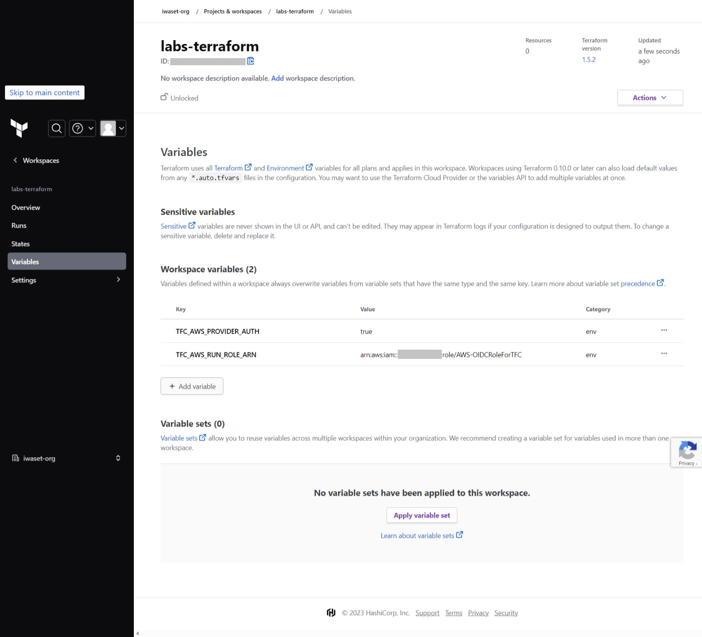

# Terraform Cloud Dynamic Provider Credentialsの設定

- [1. AWSコンソール側の設定](#1-awsコンソール側の設定)
    - [1.1. OIDC Provider作成](#11-oidc-provider作成)
    - [1.2. IAMロール作成](#12-iamロール作成)
    - [1.3. IAMロール信頼関係の修正](#13-iamロール信頼関係の修正)
- [2. Terraform Cloud側の設定](#2-terraform-cloud側の設定)
    - [2.1. Variables設定](#21-variables設定)

## 1. AWSコンソール側の設定
### 1.1. OIDC Provider作成
ブラウザからAWSマネジメントコンソールにアクセスし、[IAM] > [Identity providers] > [Add provider] を選択
  

下表の設定値を入力し、[Get thumbprint]を押下する

|入力項目|値|
|--|--|
|Provider type|OpenID Connect|
|Provider URL|app.terraform.io|
|Audience|aws.workload.identity|



[Add provider]を選択



### 1.2. IAMロール作成
作成されたIDPを選択し、[Assign role]を選択する


[Create a new role]にチェックが入っていることを確認し、[Next]を選択


下表の設定値を入力し、[Next]を選択

|入力項目|設定値|
|--|--|
|Trusted entity type|Web identity|
|Identity provider|app.terraform.io|
|Audience|aws.workload.identity|



パーミッションポリシーに下記を追加し[Next]を選択する
- AmazonEC2FullAccess
- AmazonVPCFullAccess
- AmazonSSMFullAccess

[Role name]に任意のロール名を入力し、[Create role]を選択する


### 1.3. IAMロール信頼関係の修正
1.2節で作成したIAMロールの信頼関係を選択し、[Edit trust policy]を選択  
下記の[信頼関係ポリシーテンプレート](./AWS-OIDCRoleForTFC_template.txt)に対し、下表の変数を書き換えてコピペし、上書き保存する

```json
{
    "Version": "2012-10-17",
    "Statement": [
        {
            "Effect": "Allow",
            "Principal": {
                "Federated": "OIDC_PROVIDER_ARN"
            },
            "Action": "sts:AssumeRoleWithWebIdentity",
            "Condition": {
                "StringEquals": {
                    "SITE_ADDRESS:aud": "AUDIENCE_VALUE"
                },
                "StringLike": {
                    "SITE_ADDRESS:sub": "organization:ORG_NAME:project:PROJECT_NAME:workspace:WORKSPACE_NAME:run_phase:*"
                }
            }
        }
    ]
}
```

|変数名|設定値|
|--|--|
|OIDC_PROVIDER_ARN|1.1節で作成したOIDC ProviderのARN|
|SITE_ADDRESS|Terraform CloudのProvider URL|
|AUDIENCE_VALUE|aws.workload.identity|
|ORG_NAME|Terraform CloudのOrganization名|
|PROJECT_NAME|Terraform Cloudのプロジェクト名|
|WORKSPACE_NAME|Terraform Cloudのワークスペース名|




## 2. Terraform Cloud側の設定
## 2.1. Variables設定

Terraform Cloudにサインインし、対象ワークスペースの[Variables] > [Add variable]を選択
下表の変数を追加する

|変数タイプ|変数名|設定値|
|--|--|--|
|Environment variable|TFC_AWS_PROVIDER_AUTH|true|
|Environment variable|TFC_AWS_RUN_ROLE_ARN|1.2節で作成したIAMロールARN|





IAM/SSOユーザ等のクレデンシャル情報(アクセスキー及びシークレットキー)を登録している場合、Workspace variablesから削除しておく
