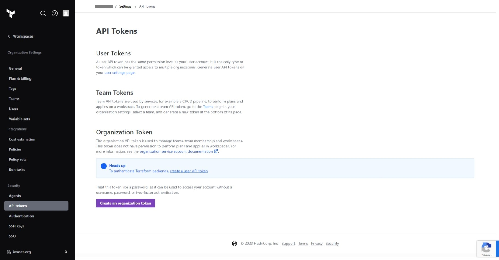
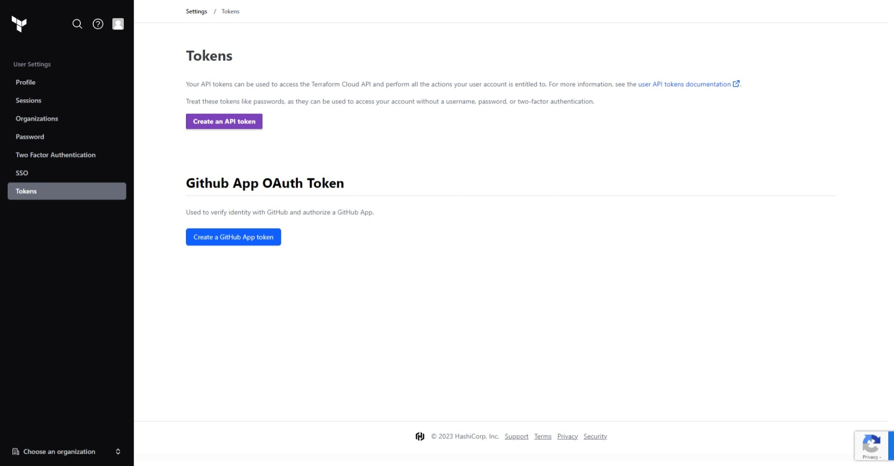
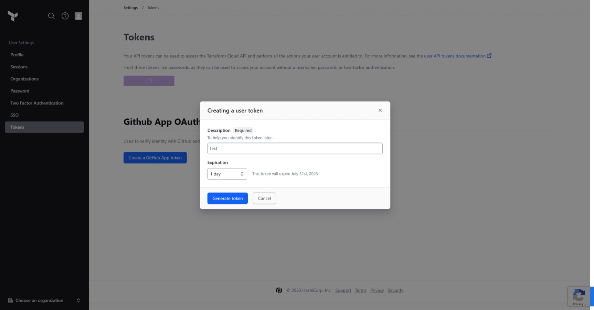
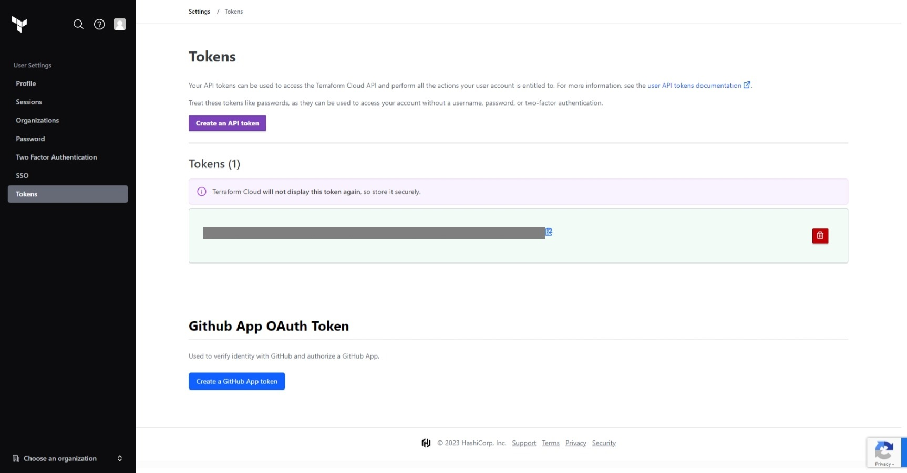
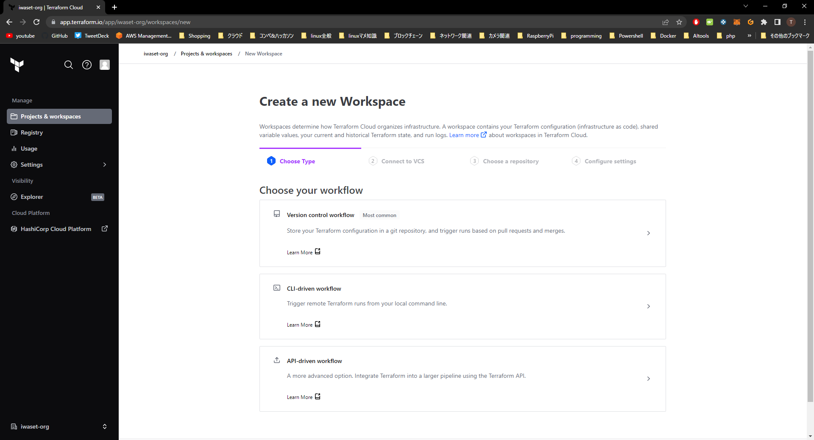
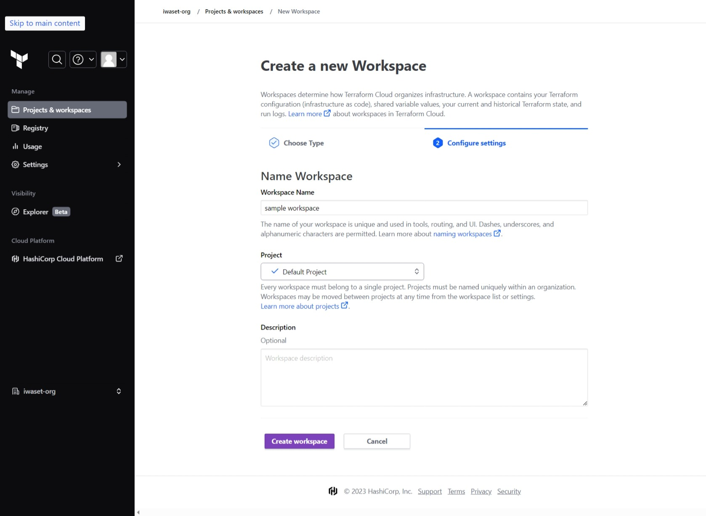
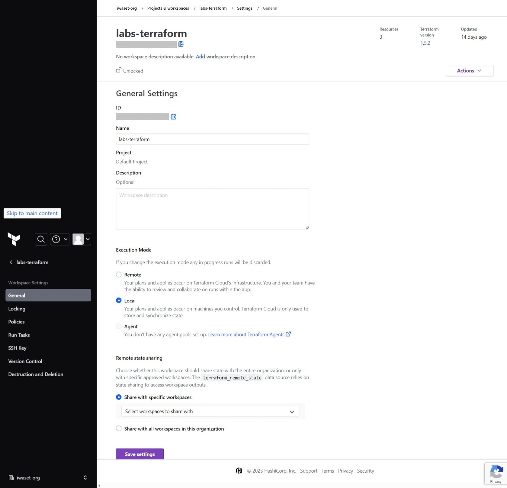

# Terraform CloudのCLI-driven WorkflowによるEC2デプロイ

[EC2デプロイ手順](#ec2デプロイ手順)  
- [terraform構成](#terraform構成)  
- [1. 事前準備](#1-事前準備)  
  - [1.1. Terraform CloudのAPI Token発行](#11-terraform-cloudのapi-token発行)
  - [1.2. Workspace新規作成](#12-workspace新規作成)
  - [1.3. Workspace設定](#13-workspace設定)
- [2. terraform実行](#2-terraform実行)
  - [2.1. Terraform Cloudでログイン](#21-terraform-cloudでログイン)
  - [2.2. provider設定](#22-provider設定)
  - [2.3. 初期化](#23-初期化)
  - [2.4. デバッグ](#24-デバッグ)
  - [2.5. 適用](#25-適用)

## terraform構成

|Directory|Module|Description|
|--|--|--|
|[aws-createVpcs](./modules/aws-createVpcs/)|module.create_vpcs|VPC/Subnet/SG作成|
<!-- |[aws-createKeyPair](./modules/aws-createKeyPair/)|module.create_keypair|キーペア作成|
|[aws-createEc2](./modules/aws-createEc2/)|module.create_instance|EC2作成| -->


## 1. 事前準備

### 1.1. Terraform CloudのAPI Token発行

※既に有効なTokenを発行している場合、本手順をスキップして「1.2. Workspace設定」へ進む

- ブラウザで下記にアクセスし、[Continue with HCP account]をクリックして、SSO(githubアカウント)でサインインする  
※Terraform Cloud用に新規アカウント作成は不要
```
https://app.terraform.io/
```

- [Settings] > [API tokens] > [User tokens]の[user settings page]を選択する


- [Create an API token]を選択する


- [Description]と[Expiration]に任意の値を入力して[Generate token]を選択する


- 生成されたTokenの値を控えておく



### 1.2. Workspace新規作成
※VCSを利用する場合、本手順をスキップしてlab-practice-05bの[1.1節](../lab-practice-05b/README.md)を実施し、下記の「1.3. Workspace設定」へ進む  

- [Projects & workspaces] > [New] > [Workspace]を選択する。 
- [1. Choose Type]ページにて、[CLI-driven workflow]を選択する
 

- [2. Configure settings]ページにて、Workspace名を入力し、[Create workspace]を押下


### 1.3. Workspace設定
- 対象のWorkspaceを選択し、[Settings] > [General] > [Exection Mode]をLocalにして、[Save settings]を選択  



## 2. terraform実行
### 2.1. Terraform Cloudでログイン  

- 作業ディレクトリへ移動する  
(実行コマンド)
```bash
cd ./lab-practice-06c; pwd; ls -l
```
(出力例)
```
/workspace/labs-terraform/lab-practice-06c
total 36
drwxr-xr-x 2 gitpod gitpod  4096 Sep 12 15:06 images
-rw-r--r-- 1 gitpod gitpod  1119 Sep 12 15:06 main.tf
drwxr-xr-x 5 gitpod gitpod    74 Sep 12 15:06 modules
-rw-r--r-- 1 gitpod gitpod   348 Sep 12 15:06 outputs.tf
-rw-r--r-- 1 gitpod gitpod   298 Sep 12 15:06 provider.tf
-rw-r--r-- 1 gitpod gitpod 10114 Sep 12 15:09 README.md
-rw-r--r-- 1 gitpod gitpod   374 Sep 12 15:06 terraform.tfvars
-rw-r--r-- 1 gitpod gitpod   352 Sep 12 15:06 variables.tf
```

- terraform cloudへログインする  
(実行コマンド)
```bash
terraform login
```

下記が出力される
```
Terraform will request an API token for app.terraform.io using your browser.

If login is successful, Terraform will store the token in plain text in
the following file for use by subsequent commands:
    /home/gitpod/.terraform.d/credentials.tfrc.json

Do you want to proceed?
  Only 'yes' will be accepted to confirm.

  Enter a value: 
```

yesと入力してエンターを押す
```
Enter a value: yes


---------------------------------------------------------------------------------

Terraform must now open a web browser to the tokens page for app.terraform.io.

If a browser does not open this automatically, open the following URL to proceed:
    https://app.terraform.io/app/settings/tokens?source=terraform-login


---------------------------------------------------------------------------------

Generate a token using your browser, and copy-paste it into this prompt.

Terraform will store the token in plain text in the following file
for use by subsequent commands:
    /home/gitpod/.terraform.d/credentials.tfrc.json

Token for app.terraform.io:
  Enter a value: 
```

先ほど控えたAPI Token値を貼り付けてエンターを押下  
```
Token for app.terraform.io:
  Enter a value: 


Retrieved token for user <ユーザ名>


---------------------------------------------------------------------------------

                                          -                                
                                          -----                           -
                                          ---------                      --
                                          ---------  -                -----
                                           ---------  ------        -------
                                             -------  ---------  ----------
                                                ----  ---------- ----------
                                                  --  ---------- ----------
   Welcome to Terraform Cloud!                     -  ---------- -------
                                                      ---  ----- ---
   Documentation: terraform.io/docs/cloud             --------   -
                                                      ----------
                                                      ----------
                                                       ---------
                                                           -----
                                                               -


   New to TFC? Follow these steps to instantly apply an example configuration:

   $ git clone https://github.com/hashicorp/tfc-getting-started.git
   $ cd tfc-getting-started
   $ scripts/setup.sh
   ```

terraform cloudによるログインが完了となる

### 2.2. Provider設定

providerファイルを開き、cloud blockに、terraform cloudのorganization名と、workspace名を設定する  
[provider.tf](./provider.tf) (8-14行目)

### 2.3. 初期化

- terraformを初期化する  
(実行コマンド)
```bash
terraform init
```
下記が出力されればok  
```bash
Initializing Terraform Cloud...
Initializing modules...

Initializing provider plugins...
- Finding latest version of hashicorp/local...
- Finding latest version of hashicorp/tls...
- Finding hashicorp/aws versions matching "4.65.0"...
- Finding latest version of hashicorp/template...
- Installing hashicorp/local v2.4.0...
- Installed hashicorp/local v2.4.0 (signed by HashiCorp)
- Installing hashicorp/tls v4.0.4...
- Installed hashicorp/tls v4.0.4 (signed by HashiCorp)
- Installing hashicorp/aws v4.65.0...
- Installed hashicorp/aws v4.65.0 (signed by HashiCorp)
- Installing hashicorp/template v2.2.0...
- Installed hashicorp/template v2.2.0 (signed by HashiCorp)

Terraform has created a lock file .terraform.lock.hcl to record the provider
selections it made above. Include this file in your version control repository
so that Terraform can guarantee to make the same selections by default when
you run "terraform init" in the future.

Terraform Cloud has been successfully initialized!

You may now begin working with Terraform Cloud. Try running "terraform plan" to
see any changes that are required for your infrastructure.

If you ever set or change modules or Terraform Settings, run "terraform init"
again to reinitialize your working directory.
```

### 2.4. デバッグ

(実行コマンド)
```bash
terraform plan
```

下記が出力されることを確認
```
Terraform used the selected providers to generate the following execution plan. Resource actions are indicated with the following symbols:
  + create

Terraform will perform the following actions:

...(中略)
 Warning: Resource targeting is in effect
│ 
│ You are creating a plan with the -target option, which means that the result of this plan may not represent all of the changes requested by the current configuration.
│ 
│ The -target option is not for routine use, and is provided only for exceptional situations such as recovering from errors or mistakes, or when Terraform specifically suggests to use it as part of an error message.
╵

─────────────────────────────────────────────────────────────────────────────────────────────────────────────────────────────────────────────────────────────────────────────────────────────────────────────────────────

Note: You didn't use the -out option to save this plan, so Terraform can't guarantee to take exactly these actions if you run "terraform apply" now.
```

### 2.5. 適用

(実行コマンド)
```bash
terraform apply
```

下記が出力される

```
...(中略)
Do you want to perform these actions?
  Terraform will perform the actions described above.
  Only 'yes' will be accepted to approve.

  Enter a value: 
```

yesと入力してエンター押す

```
  Enter a value: yes

│ Warning: Applied changes may be incomplete
│ 
│ The plan was created with the -target option in effect, so some changes requested in the configuration may have been ignored and the output values may not be fully updated. Run the following command to verify that
│ no other changes are pending:
│     terraform plan
│ 
│ Note that the -target option is not suitable for routine use, and is provided only for exceptional situations such as recovering from errors or mistakes, or when Terraform specifically suggests to use it as part of
│ an error message.
╵

Apply complete! Resources: 3 added, 0 changed, 0 destroyed.

Outputs:

(以下略...)
```
